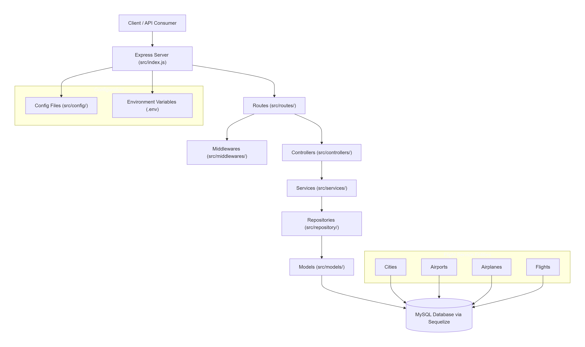

# Welcome to Flights Service

Flight Service is a backend API for searching and managing flights, airports, cities, and airplanes. The project uses Node.js, Express, Sequelize, and MySQL and follows a layered architecture with controllers, services, repositories, models, and migrations.

## Project Overview

- The API supports city, airport, airplane, and flight data management.
- A flight belongs to an airplane, and one airplane can be used in multiple flights.
- A city has many airports, and one airport belongs to a city.
- One airport can have many flights, but a flight belongs to one airport.

## Run Backend

```bash
npm run dev
# OR
npx nodemon src/index.js
```

## Project Setup

- clone the project on your local
- Execute `npm install` on the same path as of your root directory of teh downloaded project
- Create a `.env` file in the root directory and add the following environment variable
    - `PORT=3000`
- Inside the `src/config` folder create a new file `config.json` and then add the following piece of json

```bash
{
  "development": {
    "username": <YOUR_DB_LOGIN_NAME>,
    "password": <YOUR_DB_PASSWORD>,
    "database": "Flights_Search_DB_DEV",
    "host": "127.0.0.1",
    "dialect": "mysql"
}
```

- Once you've added your db config as listed above, go to the src folder from your terminal and execute `npx sequelize db:create`
and then execute

`npx sequelize db:migrate`

## DB Design

```markdown
## DB Design
  - Airplane Table
  - Flight
  - Airport
  - City 

  - A flight belongs to an airplane but one airplane can be used in multiple flights
  - A city has many airports but one airport belongs to a city
  - One airport can have many flights, but a flight belongs to one airport


Tables

### City -> id, name, created_at, updated_at
### Airport -> id, name, address, city_id, created_at, updated_at
    Relationship -> City has many airports and Airport belongs to a city (one to many)
```

Additional project details:

- `src/index.js` starts the Express server.
- `src/config/db.js` and `src/config/config.json` manage database connection configuration.
- `src/controllers` contains request handlers for airport, city, and flight routes.
- `src/services` contains business logic for managing entities.
- `src/repository` contains Sequelize database access logic.
- `src/migrations` defines the database schema for cities, airports, airplanes, and flights.
- `src/seeders` includes initial data for airports and airplanes.

## Commands related to npx sequelize

```bash
npx sequelize init 
# will create models, migrations, seeders folder and config/config.json

npx sequelize db:create 
# creates the database defined in Sequelize config file

npx sequelize model:generate --name City --attributes name:String
# generates City model(table) and also migrations file of City

npx sequelize model:generate --name Airport --attributes name:String,address:String,cityId:integer

npx sequelize db:migrate 
# runs all pending Sequelize migrations

npx sequelize db:migrate:undo
# undo the most recent migration

npx sequelize seed:generate --name add-airports
# generates a new seeder file named add-airports in seeders folder

npx sequelize db:seed:all
# runs all seeder files and inserts data into the database
```

## How to use this project

1. Configure the database connection in `src/config/config.json`.
2. Run `npx sequelize db:create` to create the database.
3. Run `npx sequelize db:migrate` to apply all migrations.
4. Run `npm run dev` or `npx nodemon src/index.js` to start the server.

## Notes

- The project is designed to run with MySQL using Sequelize.
- Ensure your MySQL server is running and credentials match the config file.
- Use the defined Sequelize commands to manage models, migrations, and seed data.

## Flight Service Diagram
